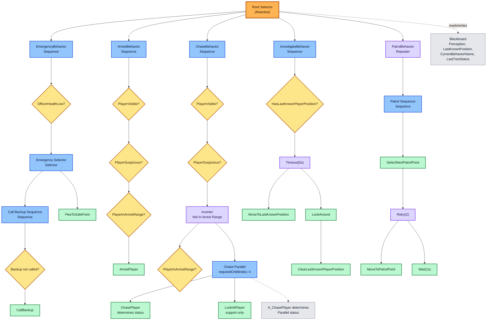

# Police Behavior Tree Demo - Aktuelle Tree-Struktur

## Kurze Erklaerung

Diese Dokumentation beschreibt die aktuell in `PoliceBehaviorTreeRunner.cs` gebaute Behavior-Tree-Struktur. Der Sheriff prueft pro Tick seine Perception, schreibt zentrale Werte ins `PoliceBlackboard` und tickt danach den Tree in einer konfigurierbaren Tickrate.

Der Root ist ein reaktiver Selector (`rememberRunningChild: false`). Dadurch startet die Prioritaetspruefung bei jedem Tick wieder beim ersten Child. Eine laufende Patrol kann also sofort durch Emergency, Arrest, Chase oder Investigate unterbrochen werden.

## Vollstaendige Tree-Struktur

```text
Root Selector (Reactive, rememberRunningChild: false)
├── EmergencyBehavior (Sequence)
│   ├── C_OfficerHealthLow
│   └── Emergency Selector (Selector, memory-based)
│       ├── Call Backup Sequence (Sequence)
│       │   ├── C_NotBackupCalled
│       │   └── A_CallBackup
│       └── A_FleeToSafePoint
│
├── ArrestBehavior (Sequence)
│   ├── C_PlayerVisible
│   ├── C_PlayerSuspicious
│   ├── C_PlayerInArrestRange
│   └── A_ArrestPlayer
│
├── ChaseBehavior (Sequence)
│   ├── C_PlayerVisible
│   ├── C_PlayerSuspicious
│   ├── Not In Arrest Range (Inverter)
│   │   └── C_PlayerInArrestRange
│   └── Chase Parallel (Parallel, requiredChildIndex: 0)
│       ├── A_ChasePlayer        [required/main child]
│       └── A_LookAtPlayer       [support child]
│
├── InvestigateBehavior (Sequence)
│   ├── C_HasLastKnownPlayerPosition
│   ├── Move To Last Known Position Timeout (Timeout, 5s)
│   │   └── A_MoveToLastKnownPosition
│   ├── A_LookAround
│   └── A_ClearLastKnownPlayerPosition
│
└── PatrolBehavior (Repeater, infinite)
    └── Patrol Sequence (Sequence)
        ├── A_SelectNextPatrolPoint
        ├── Move To Patrol Point Retry (Retry, 2 attempts)
        │   └── A_MoveToPatrolPoint
        └── BTWaitAction ("Patrol Wait", 1s)
```

## Mermaid-Diagramm



## Legende

- Orange/Rot: Root Selector. Er ist reaktiv und prueft jeden Tick wieder von oben.
- Blau: Composite Nodes wie `Sequence`, `Selector` und `Parallel`.
- Gelb: Conditions. Sie beantworten Fragen aus dem Blackboard, z. B. `PlayerVisible?`.
- Gruen: Actions. Sie fuehren Demo-Verhalten aus, z. B. `ChasePlayer`.
- Violett: Decorators wie `Inverter`, `Timeout(5s)`, `Retry(2)` und `Repeater`.
- Grau: Blackboard-/Debug-Hinweise.

## Graphviz

Die DOT-Version liegt in `PoliceBehaviorTree.dot`. Wenn Graphviz installiert ist, kann daraus ein SVG oder PNG erzeugt werden:

```powershell
dot -Tsvg Assets/_Demo/BehaviorTreePolice/Docs/PoliceBehaviorTree.dot -o Assets/_Demo/BehaviorTreePolice/Docs/PoliceBehaviorTree.svg
dot -Tpng Assets/_Demo/BehaviorTreePolice/Docs/PoliceBehaviorTree.dot -o Assets/_Demo/BehaviorTreePolice/Docs/PoliceBehaviorTree.png
```
